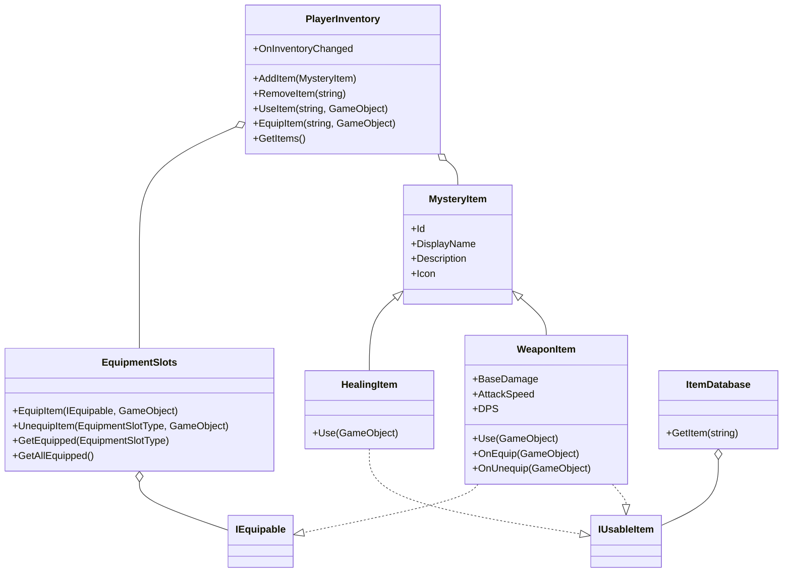

# Documentación del Proyecto Unity: Manual de Clases, Métodos y Variables

## Índice
1. [Clases Principales](#clases-principales)
2. [Manual de Métodos](#manual-de-métodos)
3. [Manual de Variables](#manual-de-variables)
4. [Sistema de Inventario e Ítems Usables](#sistema-de-inventario-e-items-usables)
5. [Sistema de Armas y Equipamiento](#sistema-de-armas-y-equipamiento)
6. [Eventos, Extensibilidad y Arquitectura Global](#eventos-extensibilidad-y-arquitectura-global)
7. [Buenas Prácticas y Seguridad](#buenas-practicas-y-seguridad)
8. [Ejemplos de Uso](#ejemplos-de-uso)
9. [Diagrama de Arquitectura](#diagrama-de-arquitectura)

---

## Clases Principales

### Inventory.MysteryItem
- Ítem misterioso. Su tipo real y descripción se revelan solo al usarlo o al mostrar el tooltip en el inventario.
- Todos los campos son privados y expuestos solo por propiedades públicas de solo lectura.
- Propiedades: `Id`, `DisplayName`, `Description`, `Icon`.

### Inventory.WeaponItem
- Hereda de `ScriptableObject` e implementa `IUsableItem` e `IEquipable`.
- Representa un arma con daño base y velocidad de ataque.
- Propiedades: `BaseDamage`, `AttackSpeed`, `DPS`.
- Métodos: `Use(GameObject user)`, `GetSlotType()`, `OnEquip(GameObject user)`, `OnUnequip(GameObject user)`.

### Inventory.HealingItem
- Ítem de curación que implementa `IUsableItem`.
- Método: `Use(GameObject user)` (cura al jugador).

### Inventory.PlayerInventory
- Inventario limitado a un número configurable de slots no stackeables (por defecto 5).
- Todos los campos son privados y expuestos solo por métodos públicos.
- Métodos: `AddItem(MysteryItem)`, `RemoveItem(string)`, `UseItem(string, GameObject)`, `EquipItem(string, GameObject)`, `GetItems()`.
- Evento: `OnInventoryChanged`.

### Inventory.Equipamiento.EquipmentSlots
- Gestiona los ítems equipados por el jugador en diferentes slots.
- Métodos: `EquipItem(IEquipable, GameObject)`, `UnequipItem(EquipmentSlotType, GameObject)`, `GetEquipped(EquipmentSlotType)`, `GetAllEquipped()`.

### Inventory.ItemDatabase
- Catálogo centralizado de ítems usables y armas.
- Métodos: `GetItem(string id)`.

### Characters.HealthControllerBase
- Clase abstracta base para controladores de salud y muerte de entidades.
- Gestiona vida, daño, debuffs y eventos de muerte.
- Métodos: `TakeDamage(int)`, `Death()` (abstracto).
- Propiedad: `Health` (solo lectura).

### GameEventBus
- Event Bus global para publicar y suscribirse a eventos de juego de forma desacoplada.
- Métodos: `Subscribe<T>`, `Unsubscribe<T>`, `Publish<T>`.

### GameServices
- Service Locator global para registrar y obtener servicios del juego (inventario, eventos, etc).
- Métodos: `Register<T>`, `Get<T>`.

---

## Manual de Métodos

### PlayerInventory
- **AddItem(MysteryItem item)**
  - Agrega un ítem al inventario si hay espacio y no existe ya.
  - **Parámetros:**
    - `item`: Objeto de tipo `MysteryItem` a agregar.
  - **Retorna:** `true` si se agregó correctamente, `false` si el inventario está lleno o el ítem ya existe.
  - **Uso típico:** Cuando el jugador recoge un objeto del mundo.
  - **Advertencia:** No permite ítems duplicados ni stackeables.

- **RemoveItem(string itemId)**
  - Quita un ítem del inventario por su ID.
  - **Parámetros:**
    - `itemId`: Identificador único del ítem a eliminar.
  - **Retorna:** `true` si se eliminó, `false` si no estaba presente.
  - **Uso típico:** Al consumir, usar o descartar un ítem.

- **UseItem(string itemId, GameObject user)**
  - Usa un ítem del inventario, ejecutando su efecto y eliminándolo.
  - **Parámetros:**
    - `itemId`: Identificador del ítem a usar.
    - `user`: GameObject que usará el ítem (normalmente el jugador).
  - **Retorna:** `true` si el ítem fue usado, `false` si no existe o no es usable.
  - **Uso típico:** Al presionar un botón en la UI de inventario.
  - **Advertencia:** Elimina el ítem tras su uso.

- **EquipItem(string itemId, GameObject user)**
  - Equipa un ítem del inventario si es equipable.
  - **Parámetros:**
    - `itemId`: Identificador del ítem a equipar.
    - `user`: GameObject que equipa el ítem.
  - **Retorna:** `true` si se equipó correctamente, `false` si no es equipable o no existe.

- **GetItems()**
  - Devuelve una lista de los ítems en el inventario.
  - **Retorna:** `IReadOnlyList<MysteryItem>` para evitar modificaciones externas.
  - **Uso típico:** Para poblar la UI de inventario.

### EquipmentSlots
- **EquipItem(IEquipable item, GameObject user)**
  - Equipa un ítem en el slot correspondiente, reemplazando el anterior si existe.
- **UnequipItem(EquipmentSlotType slotType, GameObject user)**
  - Desequipa el ítem del slot indicado.
- **GetEquipped(EquipmentSlotType slotType)**
  - Devuelve el ítem equipado en el slot indicado.
- **GetAllEquipped()**
  - Devuelve todos los ítems equipados.

### WeaponItem
- **Use(GameObject user)**
  - Equipa el arma y muestra feedback en consola.
- **OnEquip(GameObject user)**
  - Aplica efectos de equipamiento (modificar stats, etc).
- **OnUnequip(GameObject user)**
  - Revierte efectos de equipamiento.

### HealingItem
- **Use(GameObject user)**
  - Cura al jugador.

### ItemDatabase
- **GetItem(string id)**
  - Devuelve el ítem usable registrado con ese ID.

### HealthControllerBase
- **TakeDamage(int amount)**
  - Aplica daño a la entidad y dispara eventos si la salud llega a cero.
- **Death()**
  - Método abstracto para lógica personalizada de muerte.

---

## Manual de Variables

### PlayerInventory
- **maxSlots** (`int`): Número máximo de slots en el inventario (por defecto 5). Modificable en el inspector.
- **OnInventoryChanged** (`event Action`): Evento disparado al cambiar el inventario. Útil para actualizar la UI.

### MysteryItem
- **Id** (`string`): Identificador único del ítem. Usado para búsquedas y lógica.
- **DisplayName** (`string`): Nombre visible del ítem.
- **Description** (`string`): Texto para mostrar en tooltip o detalles.
- **Icon** (`Sprite`): Imagen para mostrar en la UI.

### WeaponItem
- **BaseDamage** (`int`): Daño base del arma.
- **AttackSpeed** (`float`): Ataques por segundo.
- **DPS** (`float`): Daño por segundo calculado automáticamente.

---

## Sistema de Inventario e Ítems Usables

- El inventario almacena hasta un número configurable de ítems no stackeables.
- Los ítems pueden ser misteriosos (tipo oculto) y muestran su descripción en la UI al hacer hover.
- Los ítems usables implementan la interfaz `IUsableItem` y se registran en `ItemDatabase`.
- El equipamiento se gestiona mediante la clase `EquipmentSlots` y la interfaz `IEquipable`.
- Ejemplo de uso:

```csharp
// Recoger un arma
yourItemDatabase.GetItem("espada");
playerInventory.AddItem(espada as MysteryItem);

// Usar un ítem
playerInventory.UseItem("espada", playerGameObject);
```

---

## Sistema de Armas y Equipamiento

- Las armas (`WeaponItem`) tienen daño base, velocidad de ataque y calculan su DPS.
- Al usar un arma desde el inventario, se equipa y muestra feedback.
- El equipamiento se gestiona mediante `EquipmentSlots` y la interfaz `IEquipable`.
- Ejemplo de registro en ItemDatabase:

```csharp
items["hacha"] = new WeaponItem("hacha", "Hacha", "Un hacha pesada y poderosa.", 30, 0.7f);
```

---

## Sistema de Durabilidad de Armas y Auto-equipamiento

- El personaje solo puede equipar un arma a la vez.
- Cada arma equipada tiene un valor de durabilidad máxima (`MaxDurability`) y una curva de desgaste (`DurabilityCurve`).
- Cada golpe efectivo a un enemigo reduce la durabilidad del arma según la curva definida en el `WeaponItem`.
- Cuando la durabilidad llega a 0, el arma se destruye automáticamente y se elimina del slot de equipamiento.
- Si el arma equipada se rompe, el sistema busca automáticamente la primera arma disponible en el inventario y la equipa como arma de reserva.
- Si no hay armas en el inventario, el personaje queda sin arma equipada.
- El sistema es flexible: puedes definir curvas de desgaste lineales, exponenciales, etc., desde el inspector de Unity.

### Clases y Métodos Clave

- **WeaponItem** (hereda de `MysteryItem`)
  - `float MaxDurability`: Durabilidad máxima del arma.
  - `AnimationCurve DurabilityCurve`: Curva que define cómo se reduce la durabilidad por golpe.

- **WeaponInstance**
  - `WeaponItem weaponData`: Referencia al arma base.
  - `float currentDurability`: Durabilidad actual.
  - `int hits`: Número de golpes realizados.
  - `void RegisterHit()`: Llama al golpear, actualiza la durabilidad usando la curva.
  - `bool IsBroken()`: Indica si la durabilidad llegó a 0.

- **PlayerEquipmentController**
  - `WeaponInstance EquippedWeaponInstance`: Instancia del arma equipada.
  - `void OnWeaponHitEnemy()`: Llama a `RegisterHit()` y elimina el arma si se rompe. Si hay armas de reserva, equipa automáticamente la primera encontrada en el inventario.
  - `private void AutoEquipFirstWeaponInInventory()`: Busca y equipa la primera arma disponible en el inventario.

- **AttackComponent**
  - Al golpear, usa el daño del arma equipada y reduce su durabilidad.
  - Si el arma se rompe, se elimina automáticamente y se equipa una de reserva si existe.

### Ejemplo de Uso

```csharp
// Al atacar y golpear a un enemigo:
attackComponent.TryAttack();
// Internamente:
// - Se consume stamina
// - Se aplica el daño del arma equipada
// - Se reduce la durabilidad usando la AnimationCurve
// - Si la durabilidad llega a 0, el arma se destruye y se equipa automáticamente una de reserva si existe
```

---

## Eventos, Extensibilidad y Arquitectura Global

- El sistema de inventario y otros sistemas clave exponen eventos para facilitar la integración con UI y otros sistemas.
- El EventBus (`GameEventBus`) permite comunicación desacoplada entre sistemas (logros, misiones, UI, etc).
- El Service Locator (`GameServices`) centraliza servicios globales.
- Puedes crear nuevos ítems usables implementando `IUsableItem` y registrándolos en `ItemDatabase`.
- Los controladores de salud y daño siguen el patrón de herencia y composición, con lógica modular y desacoplada.

---

## Buenas Prácticas y Seguridad

- Usa siempre métodos públicos del inventario y equipamiento para modificar su estado.
- Valida los ítems antes de agregarlos o usarlos.
- Mantén el catálogo de ítems (`ItemDatabase`) centralizado y seguro.
- Utiliza eventos para desacoplar la lógica de UI y gameplay.
- Encapsula todos los campos y expón solo lo necesario mediante propiedades o métodos públicos.
- Usa `[SerializeField] private` para exponer campos en el inspector sin perder privacidad.
- Suscríbete y desuscríbete correctamente a eventos en `OnEnable`/`OnDisable`.
- Cachea componentes en `Awake` o `Start`.
- Usa `RequireComponent` para dependencias obligatorias.

---

## Ejemplos de Uso

### Mostrar tooltip de un ítem en la UI
```csharp
// Al hacer hover sobre un slot en la UI:
var item = playerInventory.GetItems()[slotIndex];
MostrarTooltip(item.Description);
```

### Equipar un arma
```csharp
playerInventory.EquipItem("espada", playerGameObject);
// Feedback: "Espada equipada. Daño base: 20, Velocidad de ataque: 1.0"
```

---

## Diagrama de Arquitectura



---

> Esta documentación refleja la arquitectura y funcionamiento actual del sistema de inventario, ítems, armas, equipamiento y eventos. Manténla actualizada ante cualquier cambio relevante.
