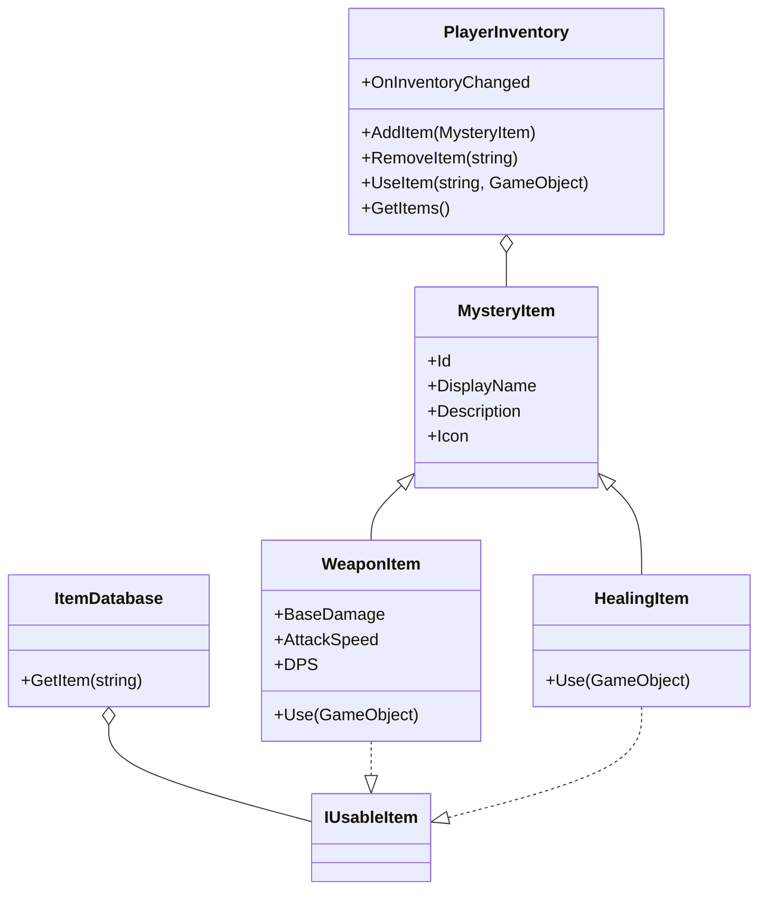

# Documentación del Proyecto Unity: Manual de Clases, Métodos y Variables

## Índice
1. [Clases Principales](#clases-principales)
2. [Manual de Métodos](#manual-de-métodos)
3. [Manual de Variables](#manual-de-variables)
4. [Sistema de Inventario e Ítems Usables](#sistema-de-inventario-e-items-usables)
5. [Sistema de Armas](#sistema-de-armas)
6. [Eventos y Extensibilidad](#eventos-y-extensibilidad)
7. [Buenas Prácticas y Seguridad](#buenas-practicas-y-seguridad)
8. [Ejemplos de Uso](#ejemplos-de-uso)
9. [Diagrama de Arquitectura](#diagrama-de-arquitectura)

---

## Clases Principales

### Inventory.MysteryItem
- Ítem misterioso. Su tipo real y descripción se revelan solo al usarlo o al mostrar el tooltip en el inventario.
- Propiedades: `Id`, `DisplayName`, `Description`, `Icon`.

### Inventory.WeaponItem
- Hereda de `MysteryItem` e implementa `IUsableItem`.
- Representa un arma con daño base y velocidad de ataque.
- Propiedades: `BaseDamage`, `AttackSpeed`, `DPS`.
- Método: `Use(GameObject user)` (equipa el arma y muestra feedback).

### Inventory.HealingItem
- Ítem de curación que implementa `IUsableItem`.
- Método: `Use(GameObject user)` (cura al jugador).

### Inventory.PlayerInventory
- Inventario limitado a 5 slots no stackeables.
- Métodos: `AddItem(MysteryItem)`, `RemoveItem(string)`, `UseItem(string, GameObject)`, `GetItems()`.
- Evento: `OnInventoryChanged`.

### Inventory.ItemDatabase
- Catálogo centralizado de ítems usables y armas.
- Métodos: `GetItem(string id)`.

---

## Manual de Métodos

### PlayerInventory
- **AddItem(MysteryItem item)**
  - Agrega un ítem al inventario si hay espacio y no existe ya.
  - **Parámetros:**
    - `item`: Objeto de tipo `MysteryItem` a agregar.
  - **Retorna:** `true` si se agregó correctamente, `false` si el inventario está lleno o el ítem ya existe.
  - **Uso típico:** Cuando el jugador recoge un objeto del mundo.
  - **Advertencia:** No permite ítems duplicados ni stackeables.

- **RemoveItem(string itemId)**
  - Quita un ítem del inventario por su ID.
  - **Parámetros:**
    - `itemId`: Identificador único del ítem a eliminar.
  - **Retorna:** `true` si se eliminó, `false` si no estaba presente.
  - **Uso típico:** Al consumir, usar o descartar un ítem.

- **UseItem(string itemId, GameObject user)**
  - Usa un ítem del inventario, ejecutando su efecto y eliminándolo.
  - **Parámetros:**
    - `itemId`: Identificador del ítem a usar.
    - `user`: GameObject que usará el ítem (normalmente el jugador).
  - **Retorna:** `true` si el ítem fue usado, `false` si no existe o no es usable.
  - **Uso típico:** Al presionar un botón en la UI de inventario.
  - **Advertencia:** Elimina el ítem tras su uso.

- **GetItems()**
  - Devuelve una lista de los ítems en el inventario.
  - **Retorna:** `IReadOnlyList<MysteryItem>` para evitar modificaciones externas.
  - **Uso típico:** Para poblar la UI de inventario.

### MysteryItem
- **Propiedades:**
  - `Id`: Identificador único del ítem.
  - `DisplayName`: Nombre visible en la UI.
  - `Description`: Texto descriptivo para tooltip.
  - `Icon`: Sprite para mostrar en la UI.

### WeaponItem
- **Propiedades:**
  - `BaseDamage`: Daño base del arma.
  - `AttackSpeed`: Velocidad de ataque (ataques por segundo).
  - `DPS`: Daño por segundo (BaseDamage * AttackSpeed).
- **Use(GameObject user)**
  - Equipa el arma y muestra feedback en consola.
  - **Parámetros:**
    - `user`: GameObject que equipa el arma.
  - **Uso típico:** Al seleccionar un arma en el inventario.
  - **Advertencia:** La lógica de equipamiento real debe implementarse según el sistema de combate.

### HealingItem
- **Use(GameObject user)**
  - Cura al jugador.
  - **Parámetros:**
    - `user`: GameObject que usará la poción.
  - **Uso típico:** Al consumir una poción desde el inventario.

### ItemDatabase
- **GetItem(string id)**
  - Devuelve el ítem usable registrado con ese ID.
  - **Parámetros:**
    - `id`: Identificador del ítem.
  - **Retorna:** Objeto que implementa `IUsableItem` o `null` si no existe.
  - **Uso típico:** Para obtener la lógica de uso de un ítem al agregarlo o usarlo.

---

## Manual de Variables

### PlayerInventory
- **maxSlots** (`int`): Número máximo de slots en el inventario (por defecto 5). Modificable en el inspector.
- **items** (`List<MysteryItem>`): Lista de ítems actuales en el inventario. No modificar directamente, usar métodos públicos.
- **OnInventoryChanged** (`event Action`): Evento disparado al cambiar el inventario. Útil para actualizar la UI.

### MysteryItem
- **id** (`string`): Identificador único del ítem. Usado para búsquedas y lógica.
- **displayName** (`string`): Nombre visible del ítem.
- **description** (`string`): Texto para mostrar en tooltip o detalles.
- **icon** (`Sprite`): Imagen para mostrar en la UI.

### WeaponItem
- **baseDamage** (`int`): Daño base del arma.
- **attackSpeed** (`float`): Ataques por segundo.
- **DPS** (`float`): Daño por segundo calculado automáticamente.

---

## Sistema de Inventario e Ítems Usables

- El inventario almacena hasta 5 ítems no stackeables.
- Los ítems pueden ser misteriosos (tipo oculto) y muestran su descripción en la UI al hacer hover.
- Los ítems usables implementan la interfaz `IUsableItem` y se registran en `ItemDatabase`.
- Ejemplo de uso:

```csharp
// Recoger un arma
var espada = ItemDatabase.GetItem("espada");
playerInventory.AddItem(espada as MysteryItem);

// Usar un ítem
playerInventory.UseItem("espada", playerGameObject);
```

---

## Sistema de Armas

- Las armas (`WeaponItem`) tienen daño base, velocidad de ataque y calculan su DPS.
- Al usar un arma desde el inventario, se equipa y muestra feedback.
- Ejemplo de registro en ItemDatabase:

```csharp
items["hacha"] = new WeaponItem("hacha", "Hacha", "Un hacha pesada y poderosa.", 30, 0.7f);
```

---

## Eventos y Extensibilidad

- El sistema de inventario expone eventos para facilitar la integración con UI y otros sistemas.
- Puedes crear nuevos ítems usables implementando `IUsableItem` y registrándolos en `ItemDatabase`.

---

## Buenas Prácticas y Seguridad

- Usa siempre métodos públicos del inventario para modificarlo.
- Valida los ítems antes de agregarlos o usarlos.
- Mantén el catálogo de ítems (`ItemDatabase`) centralizado y seguro.
- Utiliza eventos para desacoplar la lógica de UI y gameplay.

---

## Ejemplos de Uso

### Mostrar tooltip de un ítem en la UI
```csharp
// Al hacer hover sobre un slot en la UI:
var item = playerInventory.GetItems()[slotIndex];
MostrarTooltip(item.Description);
```

### Equipar un arma
```csharp
playerInventory.UseItem("espada", playerGameObject);
// Feedback: "Espada equipada. Daño base: 20, Velocidad de ataque: 1.0"
```

---

## Diagrama de Arquitectura



---

> Esta documentación refleja la arquitectura y funcionamiento actual del sistema de inventario, ítems y armas. Manténla actualizada ante cualquier cambio relevante.
