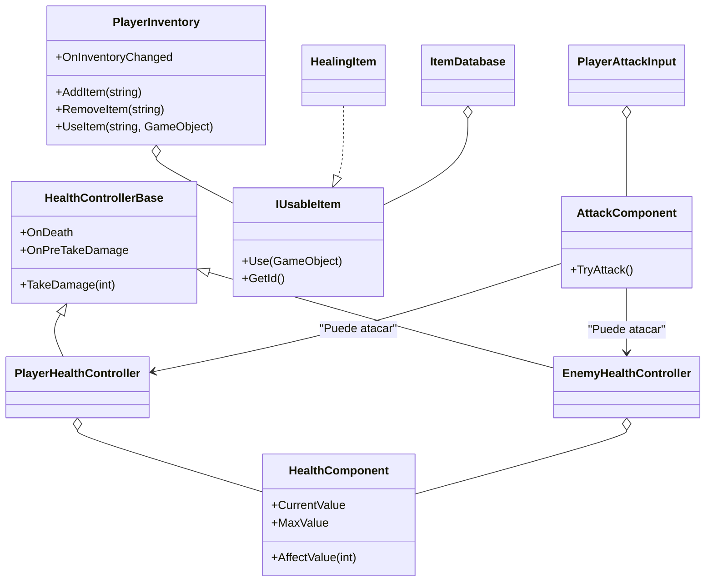

# Documentación del Proyecto Unity: Manual de Clases, Métodos y Variables

## Índice
1. [Clases Principales](#clases-principales)
2. [Manual de Métodos](#manual-de-métodos)
3. [Manual de Variables](#manual-de-variables)
4. [Sistema de Inventario e Ítems Usables](#sistema-de-inventario-e-items-usables)
5. [Eventos y Extensibilidad](#eventos-y-extensibilidad)
6. [Buenas Prácticas y Seguridad](#buenas-practicas-y-seguridad)
7. [Ejemplos de Uso](#ejemplos-de-uso)
8. [Diagrama de Arquitectura](#diagrama-de-arquitectura)

---

## Clases Principales

### Combat.Behaviours.AttackComponent
- Componente modular para lógica de ataque. Puede ser añadido a cualquier entidad (jugador, enemigo, etc.).
- Métodos: `TryAttack()` (verifica stamina y ejecuta ataque en la dirección del objeto).
- Variables: `attackRange`, `damage`, `attackCooldown`, `staminaCost`, `staminaComponent`.

### Characters.HealthControllerBase
- Clase abstracta base para controladores de salud y muerte de entidades.
- Gestiona vida, daño, debuffs y eventos de muerte.
- Métodos: `TakeDamage(int amount)`, `Death()` (abstracto)
- Eventos: `OnDeath`, `OnPreTakeDamage`

### Characters.PlayerHealthController
- Controlador de salud y muerte para el jugador. Hereda de `HealthControllerBase`.
- Métodos: `Death()` (implementación personalizada)

### Enemies.EnemyHealthController
- Controlador de salud y muerte para enemigos. Hereda de `HealthControllerBase`.
- Métodos: `Death()` (implementación personalizada)

### Components.HealthComponent
- Componente que gestiona la vida de una entidad.
- Métodos: `AffectValue(int value)`
- Propiedades: `MaxValue`, `CurrentValue`, `OnValueChanged`

### Inventory.PlayerInventory
- Inventario robusto del jugador. Permite agregar, quitar, consultar y usar ítems de forma segura.
- Métodos: `AddItem(string id)`, `RemoveItem(string id)`, `HasItem(string id)`, `UseItem(string id, GameObject user)`, `GetItems()`
- Evento: `OnInventoryChanged`

### Inventory.IUsableItem
- Interfaz para ítems usables.
- Métodos: `Use(GameObject user)`, `GetId()`

### Inventory.HealingItem
- Ítem de curación que implementa `IUsableItem`.
- Métodos: `Use(GameObject user)`, `GetId()`

### Inventory.ItemDatabase
- Catálogo centralizado de ítems usables.
- Métodos: `GetItem(string id)`

### Player.PlayerAttackInput
- Controlador de input de ataque para el jugador.
- Traduce el input del sistema y la dirección de la cámara en ataques usando `AttackComponent`.
- Variables: `playerCamera`, `attackActionName`, `attackAction`, `attackComponent`.

---

## Manual de Métodos

- **TakeDamage(int amount)**: Aplica daño a la entidad, ejecutando debuffs y eventos.
- **Death()**: Lógica personalizada al morir la entidad.
- **AffectValue(int value)**: Modifica el valor de la estadística y dispara eventos.
- **AddItem(string id)**: Agrega un ítem al inventario si es válido y no existe.
- **RemoveItem(string id)**: Quita un ítem del inventario si existe.
- **HasItem(string id)**: Verifica si el inventario contiene el ítem.
- **UseItem(string id, GameObject user)**: Usa un ítem del inventario, ejecutando su efecto y eliminándolo.
- **GetItems()**: Devuelve una lista de los IDs de ítems en el inventario.
- **Use(GameObject user)**: Ejecuta el efecto del ítem usable sobre el usuario.
- **GetId()**: Devuelve el identificador único del ítem usable.
- **GetItem(string id)**: Devuelve el ítem usable registrado con ese ID.
- **TryAttack()**: Verifica si hay suficiente stamina y ejecuta un ataque en la dirección del objeto.

---

## Manual de Variables

- **[SerializeField] private HealthComponent health**: Componente de vida.
- **public HealthComponent Health**: Propiedad de solo lectura para vida.
- **[SerializeField] private List<string> items**: Lista de IDs de ítems en el inventario.
- **public event Action OnInventoryChanged**: Evento disparado al cambiar el inventario.
- **public event Action OnDeath**: Evento disparado al morir la entidad.
- **public event Func<int, int> OnPreTakeDamage**: Evento para modificar el daño recibido antes de aplicarlo.
- **public Camera playerCamera**: Referencia a la cámara del jugador.
- **public string attackActionName**: Nombre de la acción de ataque en el sistema de input.
- **private InputAction attackAction**: Acción de input para el ataque.
- **private AttackComponent attackComponent**: Referencia al componente de ataque.

---

## Sistema de Inventario e Ítems Usables

- El inventario almacena IDs de ítems y permite su uso seguro.
- Los ítems usables implementan la interfaz `IUsableItem` y se registran en `ItemDatabase`.
- Al usar un ítem, se ejecuta su efecto (por ejemplo, curar al jugador) y se elimina del inventario.
- Ejemplo de uso:

```csharp
// Usar una poción de salud desde el inventario del jugador
playerInventory.UseItem("pocion_salud", playerGameObject);
```

---

## Eventos y Extensibilidad

- El sistema de salud y el inventario exponen eventos para facilitar la integración con UI y otros sistemas.
- Puedes crear nuevos ítems usables implementando `IUsableItem` y registrándolos en `ItemDatabase`.
- Los debuffs y efectos especiales pueden suscribirse a eventos como `OnPreTakeDamage` para modificar el daño recibido.

---

## Buenas Prácticas y Seguridad

- Usa siempre métodos públicos del inventario para modificarlo, nunca accedas directamente a la lista interna.
- Valida los IDs de ítems antes de agregarlos o usarlos.
- Mantén el catálogo de ítems (`ItemDatabase`) centralizado y seguro.
- Utiliza eventos para desacoplar la lógica de UI y gameplay.

---

## Ejemplos de Uso

### Ataque del jugador usando input y cámara
```csharp
// PlayerAttackInput escucha el input y llama a AttackComponent.TryAttack()
// El ataque solo se ejecuta si hay suficiente stamina
```

### Ataque de enemigos (IA)
```csharp
// Enemigos llaman a AttackComponent.TryAttack() desde su lógica de IA
// No dependen de input ni cámara
```

### Usar un ítem de curación desde el inventario
```csharp
// Suponiendo que tienes una referencia a PlayerInventory y al GameObject del jugador
playerInventory.AddItem("pocion_salud"); // Recoger ítem
playerInventory.UseItem("pocion_salud", playerGameObject); // Usar ítem y curar
```

### Crear y registrar un nuevo ítem usable
```csharp
// Crear un nuevo ítem de curación y registrarlo en el catálogo
ItemDatabase.RegisterItem(new HealingItem("super_pocion", 100));
```

### Suscribirse a eventos de salud
```csharp
// Suscribirse al evento de muerte del jugador
playerHealthController.OnDeath += OnPlayerDeath;

void OnPlayerDeath() {
    Debug.Log("El jugador ha muerto.");
}
```

---

## Diagrama de Arquitectura



---

> Esta documentación incluye ejemplos prácticos y un diagrama de arquitectura para facilitar la comprensión y extensión del proyecto. La lógica de ataque está centralizada en AttackComponent para máxima reutilización y mantenibilidad. El input del jugador se desacopla mediante PlayerAttackInput.
